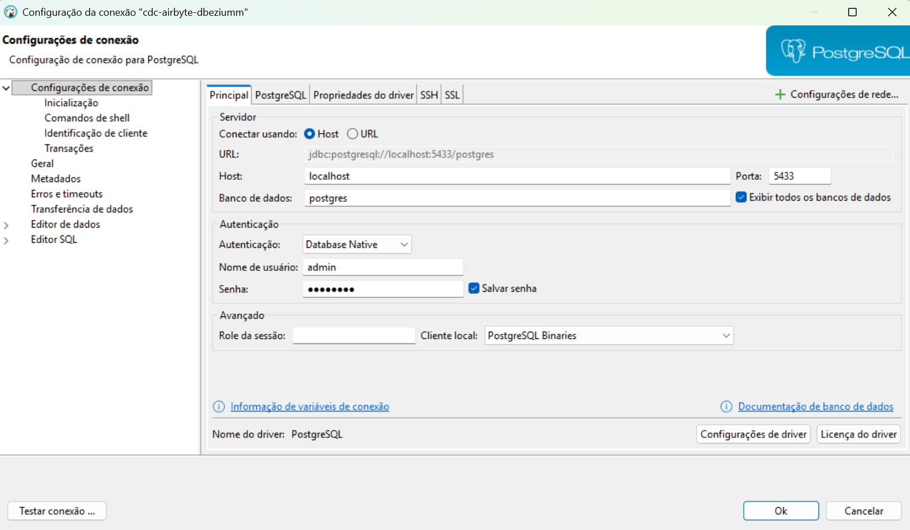
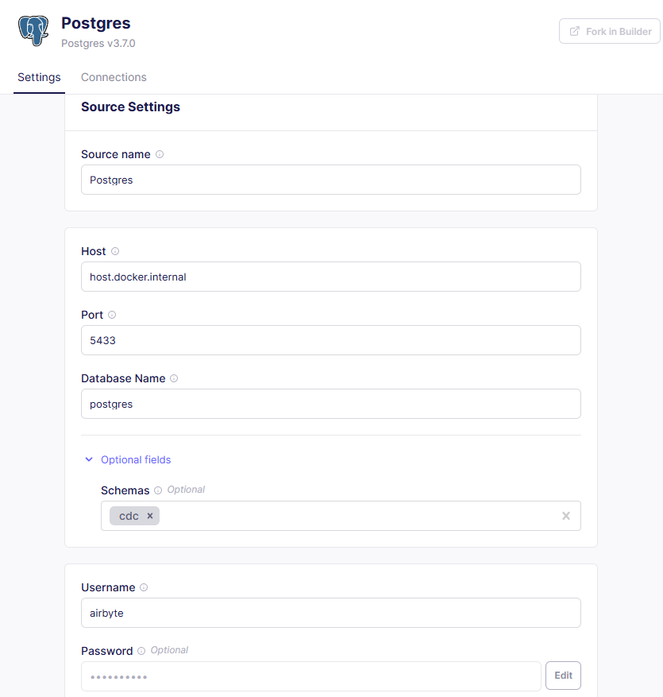
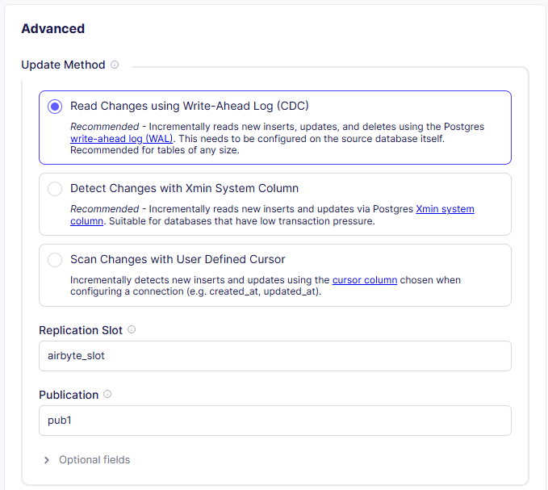
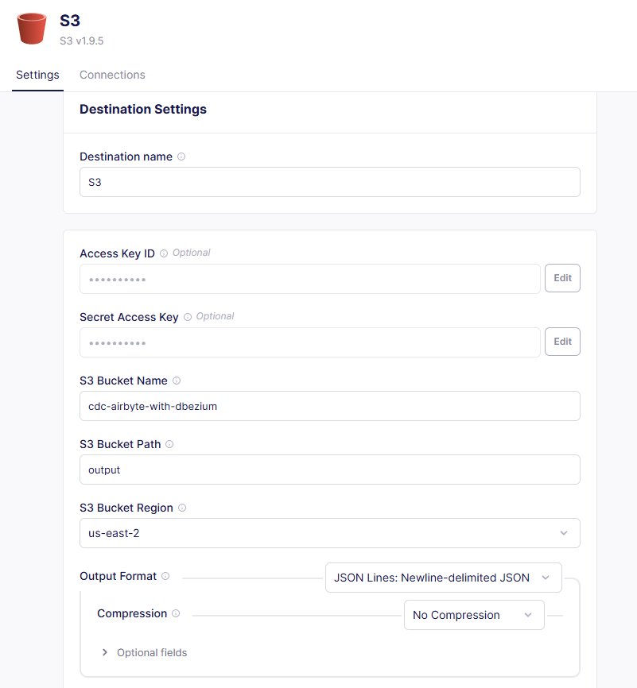
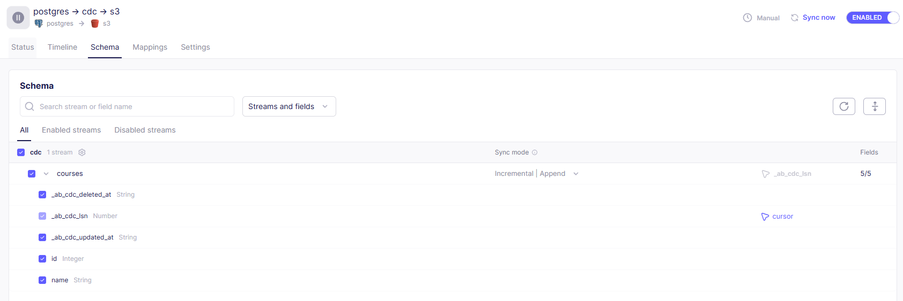
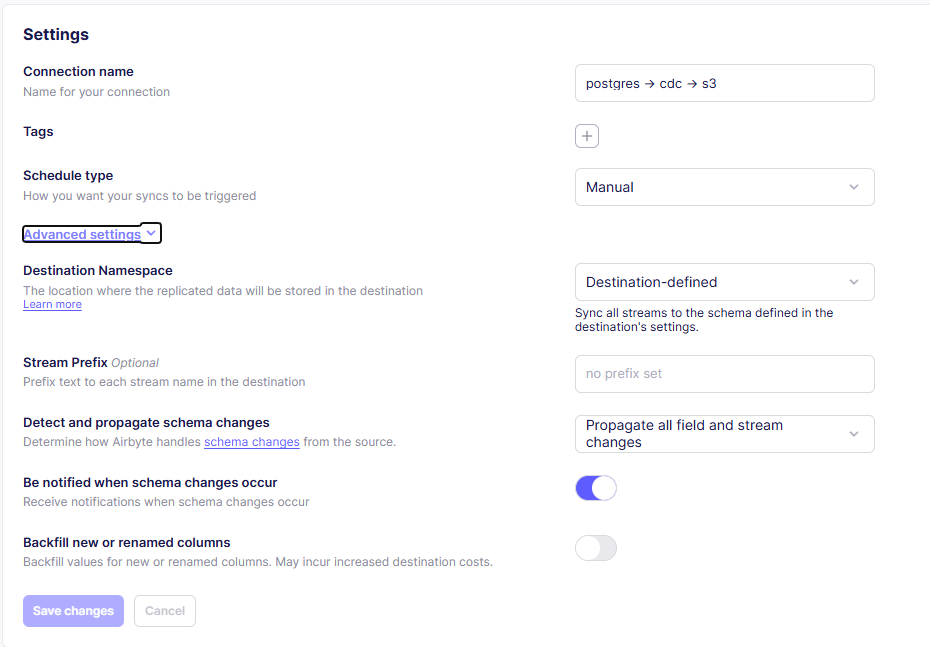

# 🔄 CDC with Airbyte and Debezium

> **Demonstração prática de Change Data Capture (CDC) usando PostgreSQL, Debezium e Airbyte**

Este projeto demonstra como implementar uma pipeline de **Change Data Capture (CDC)** para capturar e replicar mudanças em tempo real de um banco de dados PostgreSQL. Utilizamos **Debezium** para habilitar replicação lógica e **Airbyte** para orquestrar a sincronização dos dados para diferentes destinos.

## 🎯 Objetivo

Implementar uma solução de CDC (Change Data Capture) usando:
- **PostgreSQL** com **Debezium** para captura de mudanças em tempo real
- **Airbyte** para orquestração e sincronização de dados
- **Docker** para ambiente de desenvolvimento isolado e reproduzível
- **S3/Data Warehouse** como destino dos dados capturados

## 🏗️ Arquitetura da Solução

```
┌─────────────────┐     ┌─────────────────┐     ┌─────────────────┐
│   PostgreSQL    │────▶│     Airbyte     │────▶│   Destination   │
│   + Debezium    │ CDC │   (Connector)   │     │  (S3/DW/etc.)   │
└─────────────────┘     └─────────────────┘     └─────────────────┘
```

## 📁 Estrutura do Projeto

```
cdc-with-airbyte-and-dbezium/
├── 📄 README.md              # Documentação do projeto
├── 🐳 dockerfile             # Imagem Docker PostgreSQL + Debezium
├── 🐳 docker-compose.yml     # Orquestração do ambiente
├── 📝 LICENSE                # Licença MIT
├── 🔒 .env                   # Variáveis de ambiente (não versionado)
├── 🗂️ sql/
│   └── 📋 script.sql         # Script de inicialização (executado automaticamente)
├── 🗂️ pics/                  # Screenshots do tutorial
│   ├── 🖼️ create_connection_dbeaver.png
│   ├── 🖼️ configuring_source_airbyte_1.png
│   ├── 🖼️ configuring_source_airbyte_2.png
│   ├── 🖼️ configuring_destination_airbyte_1.png
│   ├── 🖼️ configuring_stream_airbyte.png
│   └── 🖼️ configuring_sync_schedule_airbyte.png
└── 🗂️ data/
    └── 🗂️ output/            # Dados de saída (se usar destino local)
```

## 🛠️ Pré-requisitos

### 📋 Ferramentas Necessárias
- **Docker** e **Docker Compose**
- **DBeaver** ou outro cliente SQL
- **Airbyte** (self-hosted ou cloud)
- **Conta AWS** (se usar S3 como destino)

### 🔑 Configuração de Credenciais

Criar um arquivo `.env` na raiz do projeto:

```bash
# PostgreSQL credentials
POSTGRES_USER=seu_usuario
POSTGRES_PASSWORD=sua_senha_segura
```

## 🚀 Roadmap

### 1️⃣ Configurar o Ambiente Docker

```bash
# Build and start the PostgreSQL container with Debezium
docker-compose up -d --build
```

> ⚡ **Inicialização Automática:** O script `sql/script.sql` é copiado para `/docker-entrypoint-initdb.d/` e executado automaticamente na **primeira inicialização** do container, criando:
> - Schema `cdc`
> - Usuário `airbyte` com permissões de replicação
> - Tabela `courses` com dados de exemplo
> - Slot de replicação e publicação para CDC

### 2️⃣ Verificar a Inicialização

Confirme que o script foi executado corretamente:

```bash
# Check initialization logs
docker-compose logs postgres_dbezium | grep -i "init"

# Verify the table was created
docker-compose exec postgres_dbezium psql -U ${POSTGRES_USER} -d postgres -c "SELECT * FROM cdc.courses;"
```

Saída esperada:
```
  id  | name  
------+-------
 1000 | FCD
 1001 | FED
 1002 | FADA
 1003 | FAD
 1004 | FEI
 1005 | FEM
(6 rows)
```

### 3️⃣ Criar Conexão com o Banco de Dados (Opcional)

Conecte-se ao PostgreSQL usando DBeaver ou outro cliente SQL para visualizar e manipular os dados:

- **Host:** `localhost`
- **Port:** `5433`
- **Database:** `postgres`
- **Username:** (definido no `.env`)
- **Password:** (definido no `.env`)



### 4️⃣ Configurar Source no Airbyte

Configure o PostgreSQL como fonte de dados no Airbyte:





### 5️⃣ Configurar Destination no Airbyte

Configure o destino desejado (S3, Data Warehouse, etc.):



### 6️⃣ Configurar Stream e Agendamento de Sync

Configure os streams de dados e o agendamento de sincronização:





### 7️⃣ Testar o CDC

Execute operações de INSERT, UPDATE e DELETE no banco de dados fonte e verifique se as mudanças são replicadas no destino:

```sql
-- Test CDC by manipulating data
INSERT INTO cdc.courses VALUES(1006, 'FIAMED');
DELETE FROM cdc.courses WHERE NAME = 'FEI';
```

### 8️⃣ Monitorar e Validar

Monitore o processo de sincronização no Airbyte e valide que as mudanças estão sendo capturadas e enviadas corretamente para o destino.

## ⚙️ Configurações Principais

### 🐳 Dockerfile

```dockerfile
# Script SQL é copiado para o diretório de inicialização do PostgreSQL
COPY sql/script.sql /docker-entrypoint-initdb.d/01-init.sql
```

> **Nota:** Scripts em `/docker-entrypoint-initdb.d/` são executados automaticamente apenas na **primeira inicialização** (quando o banco está vazio). Para reinicializar, remova os volumes: `docker-compose down -v`

### 🐘 Docker Compose

```yaml
# docker-compose.yml
services:
  postgres_dbezium:
    build: .
    image: cdc-with-airbyte-and-dbezium:dev
    ports:
      - "5433:5432"
```

### 🔧 Configuração de Replicação (script.sql)

```sql
-- Create replication slot for CDC
SELECT pg_create_logical_replication_slot('airbyte_slot', 'pgoutput');

-- Create publication for the table
CREATE PUBLICATION pub1 FOR TABLE courses;
```

## 🔐 Segurança Implementada

- **🔒 Variáveis de Ambiente**: Credenciais gerenciadas via `.env`
- **👤 Usuário Dedicado**: Usuário `airbyte` com permissões mínimas (SELECT + REPLICATION)
- **🛡️ Schema Isolado**: Dados CDC em schema dedicado (`cdc`)
- **📝 .gitignore**: Arquivos sensíveis não versionados

## 🐛 Troubleshooting

### ❌ Script SQL Não Foi Executado
```
Did not find any relation named "cdc.courses"
```
**Causa:** O banco já foi inicializado anteriormente (volume persistente).

**Solução:** Remova os volumes e recrie o container:
```bash
docker-compose down -v
docker-compose up -d --build
```

### ❌ Erro de Conexão no Airbyte
```
Connection refused: host.docker.internal:5433
```
**Solução:** Use o nome do serviço (`postgres_dbezium`) e porta interna (`5432`) se Airbyte estiver no mesmo docker-compose.

### ❌ Erro de Permissão de Replicação
```
ERROR: must be superuser or replication role to use replication slots
```
**Solução:** Execute `ALTER USER airbyte REPLICATION LOGIN;`

### ❌ Slot de Replicação Já Existe
```
ERROR: replication slot "airbyte_slot" already exists
```
**Solução:** 
```sql
SELECT pg_drop_replication_slot('airbyte_slot');
```

## 📚 Recursos e Referências

- [📖 Debezium Documentation](https://debezium.io/documentation/)
- [🔄 Airbyte Documentation](https://docs.airbyte.com/)
- [🐘 PostgreSQL Logical Replication](https://www.postgresql.org/docs/current/logical-replication.html)
- [🐳 Docker Documentation](https://docs.docker.com/)

## 🔄 Próximos Passos e Melhorias

- [ ] **🏗️ Terraform**: Infraestrutura como código para AWS
- [ ] **📊 Dashboard**: Monitoramento de métricas CDC
- [ ] **🔒 Vault Integration**: Gerenciamento seguro de secrets
- [ ] **🧪 Testes**: Testes automatizados de integração
- [ ] **📈 Alertas**: Configuração de alertas para falhas de sync
- [ ] **🌍 Multi-Region**: Replicação para múltiplas regiões

## 📞 Suporte e Contato

**Jadeson Bruno**
- 📧 Email: jadesonbruno.a@outlook.com
- 🐙 GitHub: [@JadesonBruno](https://github.com/JadesonBruno)
- 💼 LinkedIn: [Jadeson Bruno](https://www.linkedin.com/in/jadeson-silva/)

---

⭐ **Se este projeto foi útil, deixe uma estrela no repositório!**

📝 **Licença**: MIT - veja o arquivo [LICENSE](LICENSE) para detalhes.
